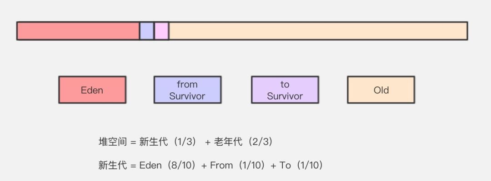

## 内存区域


### 线程独立区域

- 程序计数器
  记录编译完成的机器码的运行行数，保证多线程切换后运行不会出错

- 虚拟机栈
  运行 java 方法，类似栈的结构，调用就是入栈，返回就是出栈。虚拟机栈是由一个个栈帧组成，而每个栈帧中都拥有：局部变量表、操作数栈、动态链接、方法出口信息。局部变量表储存的是基本数据类型的值和引用类型的句柄或内存地址 (根据虚拟机的实现不同)。

  Java 虚拟机栈会出现两种异常：StackOverFlowError 和 OutOfMemoryError。

  * StackOverFlowError： 若 Java 虚拟机栈的内存大小不允许动态扩展，那么当线程请求栈的深度超过当前 Java 虚拟机栈的最大深度的时候，就抛出 StackOverFlowError 异常。
  * OutOfMemoryError： 若 Java 虚拟机栈的内存大小允许动态扩展，且当线程请求栈时内存用完了，无法再动态扩展了，此时抛出 OutOfMemoryError 异常。

- 本地方法栈
  运行 native 方法


### 线程共享区域

- 堆 储存对象的内存区域，分为新生代和老生代，详细的放到内存回收的部分整理

- 方法区 放置被加载的类的信息，常量池、方法等。

- 运行时常量池
  放置类加载完成后，字面量和符号引用那部分内容
  
- 字符串常量池
  放置字符串的字面量

### 方法区位置的变动


1.8 之前 字符串常量池和运行时常量池都在方法区内，被称为永生代。1.8 之后，为了优化回收算法，永生代被移除，方法区被放置到直接内存中被称为元空间的独立空间中，与之一起移动的还有方法区内的运行时常量池。字符串常量池被移动到 java 堆中单独开辟的区域。

元空间是每个类加载器单独享有的，当类加载器死亡以后，它加载的类信息会被一次性回收，回收的复杂度因此降低。另外，元空间在直接内存中，因此不受虚拟机内存容量限制，不容易 OOM。

```
-XX:MetaspaceSize=N // 设置 Metaspace 的初始（和最小大小）
-XX:MaxMetaspaceSize=N // 设置 Metaspace 的最大大小
```

## 内存分配和回收



堆内存区域划分如上图，对象创建会被分配到新生代的 Eden 区，Eden 满了之后会触发新生代的 MinorGC，速度较快，不会触发 StopWorld，熬过一次 MinorGC，表示对象年龄就增长 1 岁。新生代用复制算法回收，老生代才用标记 - 整理算法。老生代要满了之后就会触发 FullGC，触发 StopWorld，导致轻微卡顿。

### MinorGC 过程

- Eden 区域回收，存活者移入 From(s0) 区域，Eden 清空。如果对象内存过大，From 区不够则直接进入 Old 区。
- From 区进行回收，存活者移入 To(s1) 区域，From 区清空。如果对象内存过大，To 区不够则直接进入 Old 区。
- To 区进行回收，存活者超过 15 岁或者超过 ` 动态移送年龄 ` 后，移入 Old 区域，其他存活者移动到 From 区排列整齐，To 区清空。
- From 区和 To 区身份互换，也就是重新变成 Eden、From 是空的、To 区是排列整齐的新生代对象的状态。

### 这样划分内存的好处

大部分对象都是用完就回收，很少有存活很久的，这么划分主要目的是多用 MinorGC，少用 FullGC，在移入老生代之前让对象经历足够久的考验。同时 From、To 两部分和复制清理算法可以防止内存碎片的问题。

### 动态移送年龄的计算

如果 Survivor 空间中相同年龄所有对象大小的总和大于 Survivor 空间的一半，年龄大于或等于该年龄的对象被认为是可以移送老年代。

```
-XX:+PrintGCDetails      // 运行时打印 GC 详情
-XX:MaxTenuringThreshold // 设置移动到老年代的固定年龄

```

### 判断对象是否需要回收的依据

可达性分析算法，从根引用出发，对被引用的对象做一个有向图，可以达到的对象是有效的对象，不回收。特殊对象，比如软引用或弱引用对象看情况回收。

#### 可作为根节点的引用

- 虚拟机栈（栈帧中的本地变量表）中引用的对象
- 方法区中类静态属性 (static) 引用的对象
- 方法区中常量 (final) 引用的对象
- 本地方法栈中 JNI（即一般说的 Native 方法）引用的对象

### 引用的分类

- 强引用 正常引用
- 软引用 SoftReference，内存不足时会被垃圾回收器回收
- 弱引用 WeakReference，只要被垃圾收集器扫描到，就会被回收
- 虚引用 假的引用，是一个标记，用来检查垃圾收集器的运行状况

### 判断一个类是无用的类

- 该类所有的实例都已经被回收，也就是 Java 堆中不存在该类的任何实例。
- 加载该类的 ClassLoader 已经被回收。
- 该类对应的 java.lang.Class 对象没有在任何地方被引用，无法在任何地方通过反射访问该类的方法。
