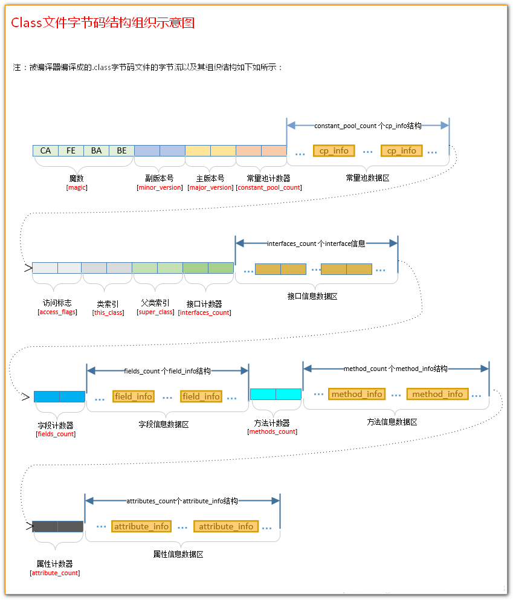

## 类的结构

根据 Java 虚拟机规范，类文件由单个 ClassFile 结构组成：




```
ClassFile {
    u4             magic; //Class 文件的标志
    u2             minor_version;//Class 的小版本号
    u2             major_version;//Class 的大版本号
    u2             constant_pool_count;//常量池的数量
    cp_info        constant_pool[constant_pool_count-1];//常量池
    u2             access_flags;//Class 的访问标记
    u2             this_class;//当前类
    u2             super_class;//父类
    u2             interfaces_count;//接口
    u2             interfaces[interfaces_count];//一个类可以实现多个接口
    u2             fields_count;//Class 文件的字段属性
    field_info     fields[fields_count];//一个类会可以有个字段
    u2             methods_count;//Class 文件的方法数量
    method_info    methods[methods_count];//一个类可以有个多个方法
    u2             attributes_count;//此类的属性表中的属性数
    attribute_info attributes[attributes_count];//属性表集合
}
```

1. 魔数 用来验证文件类型是否能被虚拟机接受
   
2. 类文件版本 分小版本和大版本，代表编译器的版本

3. 常量池

    常量池主要存放两大常量：字面量和符号引用。字面量比较接近于 Java 语言层面的的常量概念，如文本字符串、声明为 final 的常量值等。而符号引用则属于编译原理方面的概念。包括下面三类常量：

    - 类和接口的全限定名
    - 字段的名称和描述符
    - 方法的名称和描述符
    
    常量池中每一项常量都是一个表，这14种表有一个共同的特点：开始的第一位是一个 u1 类型的标志位 -tag 来标识常量的类型，代表当前这个常量属于哪种常量类型。`.class` 文件可以通过`javap -v class类名` 指令来看一下其常量池中的信息(`javap -v  class类名-> temp.txt` ：将结果输出到 temp.txt 文件)。

4. 访问标志 修饰类的词转换的，public、abstract、final 等
   
5. 当前类索引,父类索引与接口索引集合 索引用来描述当前类、父类、接口的全限定名

6. 字段表集合 用于描述接口或类中声明的变量。字段包括类级变量以及实例变量，但不包括在方法内部声明的局部变量。

7. 方法表集合 方法表的结构如同字段表一样，依次包括了访问标志、名称索引、描述符索引、属性表集合几项。

8. 属性表集合 在 Class 文件，字段表，方法表中都可以携带自己的属性表集合，以用于描述某些场景专有的信息。
   


## 对象

### 对象创建过程

1. 类加载检查，在常量池中是否能定位到该类的符号引用，检查该类是否被初始化，如果没有的话就执行类加载过程。
   
2. 分配内存，创建对象所需的内存大小在类加载完成后便可确定，为对象分配空间的任务等同于把一块确定大小的内存从 Java 堆中划分出来。分配方式有 ` 指针碰撞 ` 和 ` 空闲列表 ` 两种，选择那种分配方式由 Java 堆是否规整决定，而 Java 堆是否规整又由所采用的垃圾收集器是否带有压缩整理功能决定。比如老生代中的回收算法一般是标记 - 整理，回收内存后会移动对象，从头整齐排列。
   
   

   保证内存分配线程安全的 2 种方式:

   - CAS + 失败重试: 虚拟机采用 CAS 配上失败重试的方式保证更新操作的原子性。
   - TLAB: 为每一个线程预先在 Eden 区分配一块儿内存，JVM 在给线程中的对象分配内存时，首先在 TLAB 分配，当对象大于 TLAB 中的剩余内存或 TLAB 的内存已用尽时，再采用上述的 CAS 进行内存分配

3. 初始化零值，内存分配完成后，虚拟机需要将分配到的内存空间都初始化为零值（不包括对象头），这一步操作保证了对象的实例字段在 Java 代码中可以不赋初始值就直接使用，程序能访问到这些字段的数据类型所对应的零值。

4. 设置对象头。初始化零值完成之后，虚拟机要对对象进行必要的设置，例如这个对象是那个类的实例、如何才能找到类的元数据信息、对象的哈希码、对象的 GC 分代年龄等信息。 这些信息存放在对象头中。 另外，根据虚拟机当前运行状态的不同，如是否启用偏向锁等，对象头会有不同的设置方式。

5. 执行 init 方法。虚拟机层面的对象创建已经完成，之后执行 `init` 方法进行代码层面的初始化，这步完成后对象才真正可以使用。

### 对象的内存结构

对象在内存中的布局可以分为 3 块区域：对象头、实例数据和对齐填充。

Hotspot 虚拟机的对象头包括两部分信息，第一部分用于存储对象自身的自身运行时数据（哈希码、GC 分代年龄、锁状态标志等等），另一部分是类型指针，即对象指向它的类元数据的指针，虚拟机通过这个指针来确定这个对象是那个类的实例。

实例数据部分是对象真正存储的有效信息，也是在程序中所定义的各种类型的字段内容。

对齐填充部分不是必然存在的，也没有什么特别的含义，仅仅起占位作用。 因为 Hotspot 虚拟机的自动内存管理系统要求对象起始地址必须是 8 字节的整数倍，换句话说就是对象的大小必须是 8 字节的整数倍。而对象头部分正好是 8 字节的倍数（1 倍或 2 倍），因此，当对象实例数据部分没有对齐时，就需要通过对齐填充来补全。

### 对象的引用定位

访问方式有 ` 句柄 ` 和 ` 直接指针 ` 两种：

- 句柄: 如果使用句柄的话，那么 Java 堆中将会划分出一块内存来作为句柄池，reference 中存储的就是对象的句柄地址，而句柄中包含了对象实例数据与类型数据各自的具体地址信息。
  

- 直接指针: 如果使用直接指针访问，那么 Java 堆对象的布局中就必须考虑如何放置访问类型数据的相关信息，而 reference 中存储的直接就是对象的地址。
  

这两种对象访问方式各有优势。使用句柄来访问的最大好处是 reference 中存储的是稳定的句柄地址，在对象被移动时只会改变句柄中的实例数据指针，而 reference 本身不需要修改。使用直接指针访问方式最大的好处就是速度快，它节省了一次指针定位的时间开销。

### String 对象的内存原理

- 使用 `= "xxx"` 等于号加双引号声明的 String 会在字符串常量池中创建一个变量，在另一个地方再次申明的话，不会重复创建，只是把已有的对象指给新指针。
- 使用 `new String("xxx")` 申明时需要看情况，假设常量池已经有了，那么它在堆中创建一个对象，假设常量池中没有，那么会先在常量池中创建，然后在堆中创建一个对象，总共 2 个。
- 使用 `"ab" + "cd"` 方式会在常量池中创建一个新对象，使用 `a + b` 由 2 个 String 变量进行组合会在堆中创建一个新对象，不进常量池，他们是不同的对象。
- String 提供的 intern 方法可以将堆中的 String 对象存入常量池，假设常量池中已有，那么会直接返回已有对象的内存地址。

### String 对象的创建优化

String 内部是 `char[]`，创建 String 实际上是新建一个数组并复制原数组做填充，如下 String 中的 getChars 方法。 `“+”` 这个符号是个语法糖而已，创建过程没什么变化。

```java
    /**
     * Copy characters from this string into dst starting at dstBegin.
     * This method doesn't perform any range checking.
     */
    void getChars(char dst[], int dstBegin) {
        System.arraycopy(value, 0, dst, dstBegin, value.length);
    }

```

为什么说 StringBuilder 和 StringBuffer 会更优化呢，因为不停的使用 `“+”` 会创建新的 String 对象，而这 2 个容器的父类 AbstractStringBuilder 中，做了一个独立的数组来存 char，不会多创建太多新数组，只是不够了才扩容而已。因此假设 for 循环等情况还是用他们比较好。StringBuffer 只是在 append 方法上修饰了 `synchronized` ，其他没什么区别。

```java

    /**
     * The value is used for character storage.
     */
    char[] value;

    /**
     * The count is the number of characters used.
     */
    int count;

    public AbstractStringBuilder append(String str) {
        if (str == null)
            return appendNull();
        int len = str.length();
        ensureCapacityInternal(count + len);
        // 也是用的 getChars 方法，不过 value 是成员变量
        str.getChars(0, len, value, count);
        count += len;
        return this;
    }
```

### 基本类型的包装类和常量池

8 种基本类型的包装类中，2 种浮点型不会有缓存数据，其他 6 种在使用 valueOf 方法创建时，默认在 [-128，127] 之间会有缓存，也就是不会创建新对象。new 方式创建不会有缓存。