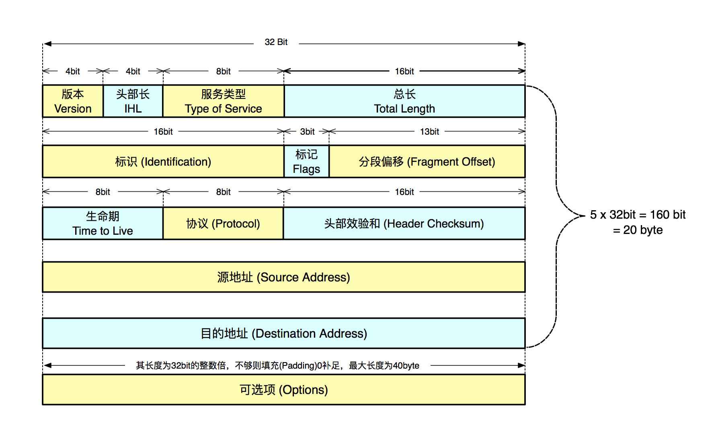

## 网络层级结构


### 应用层

实现特定功能的协议，Http、Stmp、Dns 等。

### 传输层

负责传输数据的协议，Tcp、Udp。不针对特定应用，多线程可复用同一个传输通道。组装数据为数据包进行传输，Tcp 是有连接的，可以确保传输可靠性，同时有限流、重发等控制协议。UDP 不需要握手和挥手进行连接，只负责数据发送，在丢失一部分内容也不产生影响的情况下，消耗更小。

### 网络层

Ip 协议，负责组建计算机间的网络节点，节点间的互相发现、识别和路由。

### 数据链路层

数据装帧，在相邻节点的数据链路上传输，还负责数据帧的检错、纠错

### 物理层

网络数据传输介质，如连接网络的光纤、网线和交换机、路由器等。

## IP



- 版本：记录数据报属于哪个版本的协议，例如可以用此区分出 IPv4 和 IPv6，这个字段可以使得在不同版本间传递数据变得可行。
- 头部长：标明 IP 协议报头有多长，其单位是 32bit 即 4 个字节，其最小值为 5（5 x 4 = 20 byte，这个长度是除去可选项的长度），从上图中看出，其规定头部长为 4 bit，所以最大值为 15， 15 x 4 = 60 byte 可以算出可选项长度最大为 40 个字节(即 60 byte - 20 byte = 40 byte)
- 服务类型：用来指示当数据报在一个特定网络中传输时对实际服务质量的要求是什么，服务类型字段从左到右由一个 3 位的优先顺序字段、三个标志位 (D、T、R) 和两个保留位组成。优先顺序字段用于标志该数据报的优先级，D、T、R 三个标志位分别代表是否对低延迟 (Delay)、高吞吐量(Throughput)、高可靠性(Reliability) 有要求，不过实际上，现在的路由器都忽略服务类型这个字段。
- 总长：是指整个数据报的长度，包括头部和数据部分，单位是 1 个字节，从图上可以看出，规定总长位数为 16bit，能存储最大数据为 65535 个字节的数据报。如长的数据报对大部分主机和网络来说是不现实的。所有主机必须能够接收长达 576 个字节的数据报(不管他们是以整个数据报到达还是以分片到达)，源端主机在确认目的地址能够接收大数据报的情况下才发送大于 576 字节的数据报。
- 标识：该标识由发送者设定值，主要为了目的主机组装分段时判断新到的报文分段属于哪个分组，所有属于同一分组的报文分段都包含相同的标识。
- 标记：长度为 3bit，从前到后分别是保留位、不可分段位 (DF, Don't Fragment) 和分段位(MF,More Fragment)。
    保留为始终为 0
    DF 位为 1 时表示该分组不能被分段
    MF 位为 1 时表示后面还有该分组的分段，在有分段的情况下，除了最后一个分段该位为 0 外，其他分段该位都为 1
- 分段偏移：标记该分段在数据报的位置，单位是 8 个字节，第一个分段的偏移是 0
- 生命期：用来限制分组生命周期的计数器，单位是秒，该字段长度为 8bit ，说明存储的最大数值是 255 ，在实际的应用过程中是以经过的节点计数的，每经过一个节点计数减 1 ，计数减到 0 时，分组要被丢弃。
- 协议：指明 IP 层所封装的上层协议类型，如 ICMP -> 1、IGMP -> 2 、TCP -> 6、UDP -> 17、EIGRP -> 88 、OSPF -> 89 等
- 头部效验和：只对头部进行效验，由于头部的一些字段始终在变化(例如：生命期字段)，头部效验和在每个节点都得重新进行计算。
- 源地址：发送报文段的 IP 地址
- 目的地址：接收报文段的 IP 地址
- 可选项：可选项对于主机和网关的 IP 模块来说都是必须实现的，可选是指它们在特定数据报中是否出现是可选的，而不是指他们的实现，每个可选项都以 1 个字节表明它的类型。其长度从 1~40 个字节之间不固定，主要取决于设置的可选项数目，最终数据长度不够 32 位的倍数要填充 0 补齐，主要是为了让报头长度是 32 位的整数倍，一般正常的 IP 报文头部都是没有可选项的。
目前已定义的可选项有 5 个，分别是安全性(指明数据报的机密程度)、严格路由选择(后面给出所规定的完全路由)、宽松路由选择(后面给出必须要经过的路由)、记录路由(记录下所经路由器附上其 IP 地址)、时间戳(要求所经路由器都附上其 IP 地址和时间标记)。


## TCP


- 源端口：发送数据端套接字的端口号
- 目的端口：目的套接字端口号
- 顺序号：该数据报第一个数据字节的序列号，用作标识该报文段序列号
- 应答号：存放的是发送方期望收到的数据段序号，算作是对收到报文的一个确认。ACK 标志为 0 时，应答号部分无效 (例如首个连接的[SYN] 数据包)，ACK 标志为 1 时应答号才有效
- TCP 首部长度：标明 TCP 协议报头长度，单位是 32bit 即 4 个字节，其最小值为 5（5 x 4 = 20 byte，这个长度是除去可选项的长度），从上图中看出，其规定头部长为 4 bit，所以最大值为 15， 15 x 4 = 60 byte 可以算出可选项长度大为 40 个字节(60 byte - 20 byte = 40 byte)
- 保留位：保留字段长度为 3 位，必须全置为 0
- 标记：

    NS
    Nonce
    有效排除潜在的 ECN 滥用


    CWR
    Congestion Window Reduced
    拥塞窗口减少标志


    ECE
    ECN-Echo
    ECN 标志


    URG
    Urgent
    紧急指针有效性标志


    ACK
    Acknowledgment
    确认序号有效性标志，一旦一个连接建立起来，该标志总被置为 1


    PSH
    Push
    Push 标志（接收方应尽快将报文段提交至应用层）


    RST
    Reset
    重置连接标志


    SYN
    Synchronization
    同步序号标志(建立连接时候使用)


    FIN
    Fin
    传输数据结束标志(断开连接时使用)

- 窗口：表示发送方还可以接受数据大小，防止对方发送数据大于自己的缓冲数据区，从应答字段的顺序号开始计。
- 效验和：效验和覆盖整个 TCP 报文段，强制字段，由发送端计算存储，接收端进行验证
- 紧急指针：当 Urgent 标志置 1 时，紧急指针才有效
- 可选项：可选项可以有 0 到多个，可选项字段以第一个字节表明其类型，第二个字节表示该可选项的总长度，后面紧跟可选项的值(长度为可选项的总长度 - 2)。可选项字段可以从任何字节边界开始，但若最后选项长度不足的话，要填充以补足定义的数据段长度。具体解释请看下面 3.2.2

### 三次握手

1. 客户端发送 SYN 数据包
2. 服务器返回 SYN/ACK 数据包
3. 客户端返回 ACK 数据包

### 四次挥手

1. 主动关闭方数据传输完毕，发送一个 FIN
2. 被动关闭方发送一个 ACK 表示收到，进入半关闭状态，有剩余数据则继续传输，没有则开始关闭通道
3. 被动关闭方数据传输完成，数据通道关闭，发送一个 FIN 给主动关闭方
4. 主动关闭方发送一个 ACK 表示收到，数据通道断开完成

### 可靠性保证

- 通过校验和这个参数防止数据包被篡改，如果错误，那么丢弃包
- 可变窗口保证了每个 TCP 包大小可以根据流量和处理能力调整，防止包丢失
- CWR 拥塞控制标志保证网络不畅时可以减少包发送
- 序列号 SEQ 和应答码 ACK 机制保证数据收发的对应性
- ARQ 超时重传机制，如果超时未收到这个应答，那么数据会被重传一次

## Udp


- 源端口：套接字发送端端口号
- 目的端口：目的套接字端口号
- 数据包长：UDP 报头 + UDP 数据报的长度，单位占用 1byte


## Http

总结的比较好的文档: https://juejin.im/post/5ad4465d6fb9a028da7d0117#heading-16
RFC7540 的中文文档: https://github.com/abbshr/rfc7540-translation-zh_cn

### chunked 方式传输

在 Http 处于 `Connection: keep-alive` 的长连接情况下，接收方是不知道发送方发过来的某一段数据是多大，传输何时终止的，于是通过 `Content-Length` 字段告诉接收方内容长度才行。但是文件过大的情况下，发送方要预读所有内容计算内容长度是很困难的，也不利于一次性传输。`Transfer-Encoding: chunked` 就是为解决这一的问题诞生的。

chunk 是分块传输编码，不需要知道文件总长即可开始传输。分块传输编码只在 HTTP 协议 1.1 版本（HTTP/1.1）后提供。在头部加入 `Transfer-Encoding: chunked` 之后，就代表这个报文采用了分块编码。这时，报文中的实体需要改为用一系列分块来传输。每个分块包含十六进制的长度值和数据，长度值独占一行，长度不包括它结尾的 `CRLF(\r\n)`，也不包括分块数据结尾的 CRLF。最后一个分块长度值必须为 0，对应的分块数据没有内容，表示实体结束。

也可以与 `Content-Encoding: gzip` 一起使用，在进行 gzip 压缩后，进行分块。完整例子如下

```
GET /test.php HTTP/1.1
Host: qgy18.qgy18.com
Accept-Encoding: gzip

HTTP/1.1 200 OK
Server: nginx
Date: Sun, 03 May 2015 17:25:23 GMT
Content-Type: text/html
Transfer-Encoding: chunked
Connection: keep-alive
Content-Encoding: gzip

1f
�H���W(�/�I�J

0

```

有以下特点:

- 动态内容，content-length 无法预知
- 最后一个分块长度值必须为 0，对应的分块数据没有内容
- gzip 压缩，压缩与传输同时进行


### 在浏览器中输入 url 地址 ->> 显示主页的过程

总体来说分为以下几个过程:

1. DNS 解析
2. TCP 连接
3. 发送 HTTP 请求
4. 服务器处理请求并返回 HTTP 报文
5. 浏览器解析渲染页面
6. 连接结束

### 保持用户状态

Cookie 一般用来保存用户信息，存放公开信息或者加密信息。假如被禁用，可以利用 URL 重写把 Session ID 直接附加在 URL 路径的后面。
Session 的主要作用就是通过服务端记录用户的状态。一般存在内存数据库中。

### Https 的加密方式


才用对称加密方式对内容进行加密，但是加密密钥通过服务器证书进行非对称加密。对称加密速度快，非对称加密速度慢，但安全。因此只需要对加密的密钥做一次非对称加密即可。HTTPS 协议中 SSL 协议由于漏洞已经废弃，现在多用 TLS1.2

TLS 使用的密码技术

- 伪随机数生成器：秘钥生成随机性，更难被猜测
- 对称密码：对称密码使用的秘钥就是由伪随机数生成，相较于非对称密码，效率更高
- 消息认证码：保证消息信息的完整性、以及验证消息信息的来源
- 公钥密码：证书技术使用的就是公钥密码
- 数字签名：验证证书的签名，确定由真实的某个 CA 颁发
- 证书：解决公钥的真实归属问题，降低中间人攻击概率